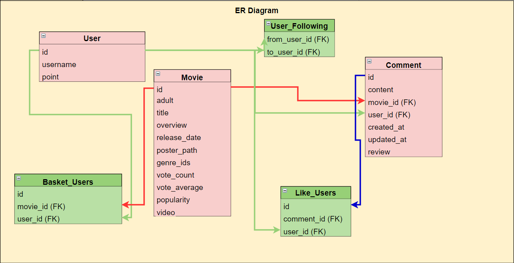

## i. 팀원 정보 및 업무 분담 내역
  ### 김재만 (FrontEnd Vue 기능 구현, 로고 제작, web page 레이아웃 제작)

  ### 김민국 (BackEnd Django 기능 구현, 디자인 캐릭터 포토샵, 게임 페이지 담당)
  
  ### 공동 작업 : 모델 설계, html, CSS 

   

  ## 날짜별로 작업한 내용
  ### 05-17(수)
    재만 : 폼 전용 입력을 위한 Content-Type에 대해 새로 알게 됨, 기본적인 커뮤니티(리뷰) 시스템 구축, 영화 페이지 제작
    민국 :  세션 방식으로 회원가입, 로그인을 구현하였지만 로그아웃에서 실패하여 dj_rest auth로 구현, 유저 모델에서 팔로우 기능 구현
  ### 05-18(목)
    재만 :  배달의 민족으로 컨셉을 정하여 관련 색상, 이미지, 폰트로 변경, 회원가입, 로그인 페이지 제작, axios 요청하여 데이터 받는 기능 완료, 캐러셀 기능 도전 > 완료
    민국 :  tmdb에서 영화 데이터를 가져오기 위해 미리 json파일로 변환, 데이터베이스 유저, 영화 모델을 설정하고 loaddata, 팔로우 수정
  ### 05-19(금)
    재만 :  가져온 video_id를 통해 영화 상세페이지에서 배경 동영상 설정, 회원가입과 로그인 폼 수정, 다른 회원 정보페이지와 내 정보 페이지 제작(팔로우, 장바구니)
    민국 : 유튜브 영상 video_id 가져오기, 영화들마다 댓글 기능 제작, 유저들마다 보고 싶은 영화를 장바구니에 담을 수 있도록 기능 구현
  ### 05-20(토)
    재만 : 홈 화면으로 가기 전 우주 페이지 제작, css 꾸미기
    민국 :  현재까지 기능 복습, 구현하며 자잘한 오류 제거
  ### 05-21(일)
    재만 : 로고, 캐릭터, 이모티콘 제작, 
    민국 : 장바구니와 팔로우 기능의 수정을 위해 리스트 자체로 정보 보내주기 기능,
  ### 05-22(월)
    재만 : 한 페이지 내 장르별로 영화 구분하여 정렬, 댓글 좋아요와 삭제 기능 추가
    민국 : 현재 기분을 예측하여 그에 맞는 장르를 추천해보는 기능
  ### 05-23(화)
    재만 : alert창 꾸미고 변경, 팔로우와 팔로워의 수만을 표현하는 것이 아닌 그에 해당하는 유저이름들도 볼 수 있도록 설정
    민국 : 키워드의 검색을 통해 제목이나 내용에 키워드가 포함된 영화만 추출하도록 구현
  ### 05-24(수)
    재만 : Youtube API Error 디버깅 처리를 하려했으나 실패 그러던 중 많은 사람들이 해당 이슈가 발생했고, 
    google 쪽 이슈를 제기, 수정 요청하였고,현재 Fixed 되었다고 google 측에서 처리 했으나
    일부 유저들은 계속해서 문제 발생 => 추후 문제점 분석후 해결 예정
    
    [구글이슈트래커](https://issuetracker.google.com/issues/158718687)
    [스택오버플로우](https://stackoverflow.com/questions/62317441/access-control-allow-origin-missing-when-uploading-to-youtube-api)
    
    민국 : 게임 페이지 구현, 웹 페이지 css 적 요소 정리.
  ### 05-25(목)
    재만 : css 최종 마무리 및 코드 정리
    민국 : 게임 포인트 django 내 user field point 연결 및 star rating 표시 구현

 
 

## ii. 목표 서비스 구현 및 실제 구현 정도
  ### 목표 서비스 구현 -> 영화 소개 사이트 및 평점, 게임을 이용한 포인트 획득 후 포인트 사용으로 영화를 보게 하는 기능.
    > 영화를 보게하는 기능 [미구현]
    > 포인트 사용으로 해당 영화가 netflix, 왓챠, wave 등 어느 OTT에서 볼 수 있는지 검색하는 기능 [미구현]
    (90% 구현 - 마지막 핵심 기능이 우리만의 서비스로 구현하기엔 요금이나, 다른 회사의 정보가 필요하여 구현 불가)

 
 

## iii. 데이터베이스 모델링 (ERD)
  

 
 

## iv. 영화 추천 알고리즘에 대한 기술적 설명

  ### 4가지 기분 상태를 고르면 해당 기분에 어울리는 장르에 해당하는 영화를 추천해주는 기능
    현재 사용자의 기분 상태 몇 가지를 예측한 다음, 그에 맞는 장르들의 영화를 나열합니다.
    ex ) 퇴근 후, 피곤할 때 에너지 회복을 위해 코미디 영화를 추천합니다.
    단, 대표적인 기분들의 예시만 있어 모든 사용자들의 기분을 예측할 수 없습니다.

 
 

## v. 서비스 대표 기능에 대한 설명

    컨셉
    > site-name : 무비의 민족

    > DNS : https://moomin.com [예정]

    사용 프레임워크 라이브러리
    > [ vue ] vuex, router, axios, bootstrap, bootstrap vue, PIXI, fontawesome, material icon, vue star rating
    
    색
    > background-color: rgb(42 193 188) [배민 배경색] - 메인 배경

    > color : white [배민 폰트색] - 메인 글자
    
    > color : rgb(166 229 227) [배민 흐린 폰트색] - 서브 글자

    폰트 : 
    > 배민 폰트 사용 배민 한나체 Pro

    서비스 기능 설명 :
    회원 가입기능, 로그인 기능, 로그아웃 기능, 영화 검색기능, 영화 기분별 추천기능, 영화 장르별 검색기능,
    팔로우, 언팔로우, 리뷰작성, 리뷰삭제, 리뷰 좋아요, 장바구니, 마이페이지, 타사용자페이지, 게임

  1.
    저희는 현재까지 잘 사용되고 있는 어플 배달의 민족을 컨셉으로 영화 추천 사이트를 만들어 보았습니다. 
    소비자들은 매일 달라지는 입맛에 따라 먹고 싶은 음식이 달라지는데 저희는 그것과 비슷하게 
    매일 달라지는 컨디션, 기분에 따라 다르게 영화들을 추천해 보고 싶었습니다. 
    또한, 배민 어플을 사용하는 사람들 중에 한식과 일식, 양식처럼 큰 분야 먼저 고르는 사용자도 있기에 
    그것에 맞추어 저희도 크게 장르 먼저 구분하고 그것에 맞는 영화들을 분류해 놓았습니다.
  2.
    영화 추천 사이트가 발달하기 위해서는 제작자의 추천 알고리즘도 중요하다고 생각하지만 각 사용자들의 추천(리뷰)도 필요하다고 생각합니다. 
    저희는 사용자들의 적극적인 참여를 이끌어내기 위해서 사용자들이 관심을 가질만 한 포인트 개념을 생각하였습니다. 
    리뷰를 쓰거나 게임에 참여할 때마다 포인트를 쌓아가는데 어느 정도 포인트를 모았다면 
    사용자에게 상품 등으로 교환해주거나 더 추가적인 서비스(각 영화 사이트마다 해당 영화가 존재하는지 알려주는)를 누릴 수 있게 해주는 것입니다.

 
 

## vi. 배포 서버 URL (배포했을 경우)
  ### 아직 배포하지 않았습니다.

 
 

## vii. 기타 (느낀 점, 후기 등)

    frontEnd를 담당한 김재만입니다. 제가 frontEnd 쪽 Vue로 작업하며 느꼈던 점은, '기능 구현은 어렵지 않으나 가장 큰 난관은 CSS다' 라는 점입니다. 
    정말 말을 안듣는 CSS(믈론 제가 잘못했었습니다만,,) 때문에 고생을 많이 했고, 고생을 많이 햇지만 그만큼 공부도 많이 되었던 CSS였습니다. 
    다른 사람의 코드와 Chat GPT가 많은 도움을 주었지만, 이러한 과정도 공부의 일환이라고 생각하고 
    회사에 들어가서도 사용할 수 있는 부분은 최대한 활용하여 코드를 짜야 한다고 생각했습니다. 
    하지만 해당 코드를 내가 분석하고 이해하는 과정은 필수적으로 진행해야지, 내가 코드만 옮겨 적었다면 
    이 후 이해하지 못하고 그냥 옮겨적은 코드 때문에 에러가 발생하는 경험을 많이 했습니다. 
    또한 마지막으로 느낀점은 제가 짠 코드가 정상적으로 동작은 하지만 올바른 코드인지? 동작이 느리진 않을지? 다른 문제점이 발생하진 않을지? 고민을 많이하였습니다. 
    제가 좀 더 효율적이고 남이 내 코드를 봐도 이해하기 좋은 직관적인 좋은 코드를 짜기 위해 앞으로도 끊임없이 고민하고 발전하는 개발자가 되어야겠다고 생각했습니다. 

    backend를 담당한 김민국입니다. 어려운 점으로 저는 주로 백엔드를 담당하여 프로젝트를 진행하였는데 
    지금까지 django로만 만든 프로젝트를 vue와 결합하여 만드려니 기본적인 url 설정, form과 serializer 구성, views 함수 정의에서 많이 막혔습니다. 
    또한, 로그인과 회원가입을 auth_login을 쓰지 않고 세션으로 시도해 보았는데 그럼 자동적으로 토큰이 채워져 로그아웃에서 막혀 어려움을 느꼈습니다. 
    마지막으로 프론트엔드에서 특정 값을 바꾸는 과정에서 백엔드에서 그 id에 해당하는 값만바꿨지만 그 바꾼 부분만을 다시 프론트엔드에서 표현하기 어려웠습니다. 
    (한 페이지에 여러 개의 좋아요 버튼의 id와 index값의 혼동)/ 새롭게 배운 점으로는 프론트엔드 과정을 도우면서 기본적으로 css 실력이 많이 증가한 것 같습니다. 
    또, vue 에서 요청을 하고 django에서 처리를 하고 응답을 보낸 뒤 다시 vue에서 처리해주는 기본 순서와 과정을 이해하였습니다. 
    어떤 경우에 form, 또 어떤 경우에 serializer를 써야 할지 결정하는 것과 model 속성도 추가해주고 불러오는 것에 많이 익숙해졌습니다. 
    이번 프로젝트를 하면서 느낀 점은 무엇보다 프로젝트를 통해 교과서로만 배울 수 없는 것을 알게 될수 있구나 입니다. 
    이론으로 배운 일반적인 상황만이 존재하지 않았고 많은 예외 상황, 에러를 직면하고 다른 해결 방법을 조원과 찾는 과정에서 많은 공부가 되었습니다. 
    그리고 혼자만의 프로젝트가 아닌 팀원과 같이 하는 프로젝트인 만큼 책임 의식을 느꼈고 2학기 프로젝트를 더 열심히 준비해야겠다고 생각하였습니다.

 
 